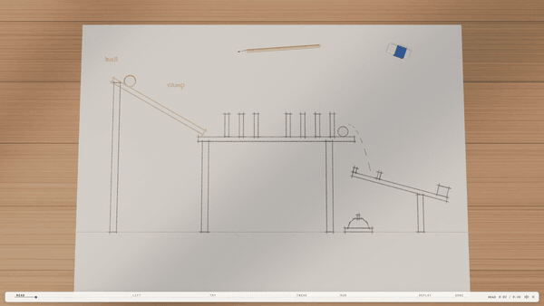
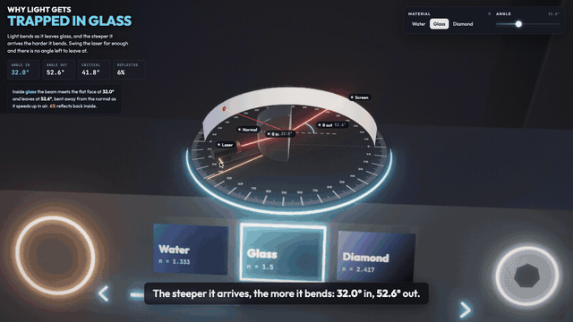

# Claude animation skills

Three agent skills for making short launch and explainer films with code. `horizon-reel` cuts together collage horizons in the style of Claude's model-launch films. `sketch-to-sim` turns a pencil sketch of a machine into a film: the drawing is read, lifts off the paper as a wooden model and runs under real physics. `lab-explainer` builds a 3D explainer in which an apparatus on a lab bench demonstrates a formula, with every number on screen computed from the real equation. All three render frame by frame in headless Chromium, so the same input always gives the same film, and none uses an image or video model.

## horizon-reel


Each shot cuts to a new dome-shaped horizon: a museum plate, a lace veil, a microscope slide, a chalk drawing, the edge of the Earth. A line of serif copy rides the curve, and the reel ends on your brand lockup over a rising planet limb. The images are real public-domain and CC0 files from the Met, the Art Institute of Chicago, NASA and Wikimedia Commons, downloaded with their credits logged. The drawn shots are procedural canvas.

> Make a 10 second launch reel for our v2.0 release, in the Claude launch video style. Copy: "v2.0" / "is out" / "today". End on our logo, media/logo.png.

The agent writes the copy, sources and picks images, drafts `film.json`, checks a stills sheet, then renders an MP4, a GIF under GitHub's 10MB limit, and a credits file for every photograph used. You can run the same steps by hand from `skills/horizon-reel`:

```bash
node scripts/source.mjs ~/reel/media --from met --q "plate" --medium Ceramics --n 6
node scripts/sheet.mjs ~/reel/media ~/reel/candidates.png
node scripts/render.mjs ~/reel/film.json ~/reel/stills.png --stills
node scripts/render.mjs ~/reel/film.json ~/reel/reel.mp4 --gif --audio track.m4a --audio-start 9.7
```

`skills/horizon-reel/examples/opus-5-5/` holds the film in the preview. Run `bash source.sh` in a copy of that folder to fetch its images.

## sketch-to-sim



A machine is one small JS file of side-view parts (boxes, beams, balls, wheels and convex polygons), hinges, a couple of parameters, the triggers that make up its chain of cause and effect, and a story. The engine draws the pencil sketch, labels and measures it, and stands it up as paper cut-outs that fill in as pine, oak, walnut, brass and steel. Every run is baked with Rapier at 240 Hz.

The story follows the demo. A first run fails for a real reason, a rewind tweaks one parameter, the next run works, a 0.25× replay shows the measured speeds, and a "Build it yourself" panel ends the film with sliders, Run and Reset that work in the live page. The soundtrack is synthesised from the simulation's own contact events, so every knock and ding lands on the frame where it happens.

> Make a sketch-to-simulation film of a Rube Goldberg machine: a ball rolls down a ramp, knocks over dominoes, drops a second ball onto a seesaw that rings a bell.

The agent designs or reads the machine, then tunes it headlessly until both the failure and the success really happen. It then writes the story, checks stills and renders a 1080p60 MP4 with sound. You can run the same steps by hand from `skills/sketch-to-sim`:

```bash
node scripts/tune.mjs examples/rube-goldberg/machine.js --scan gap=0.03:0.08:0.005
node scripts/capture.mjs examples/rube-goldberg/machine.js sheet.png --stills 5,20,30,40,48,60 --dpr 1
node scripts/capture.mjs examples/rube-goldberg/machine.js film.mp4 --video --fps 60 --dpr 2
node scripts/sound.mjs examples/rube-goldberg/machine.js film.wav
node scripts/serve.mjs examples/rube-goldberg/machine.js
```

There are two examples. `examples/rube-goldberg/` is the machine in the preview. `examples/trebuchet/` is a counterweight trebuchet aimed at a block tower: it throws short at 0.48 kg and knocks the tower down at 0.68 kg.

## lab-explainer



A film is a dark studio: a console with a control panel, and an apparatus that demonstrates one formula. A title card carries live stats and a sentence that rewrites itself from the numbers every frame. A control panel shows buttons being pressed and sliders moving, part labels float on the model, and the camera cuts between four or five setups while the scene answers each change the way the equation says it should. Timed captions carry the explanation one large sentence at a time, so the film reads on a phone. Rays, beams and planes are drawn from the same model as the numbers, and a depth-of-field pass can blur a scene the way an instrument inside it sees rather than the way the camera does.

> Make a 30 second explainer on why light gets trapped in glass: a laser, a half-round block, the angle going past critical, then water and diamond.

The agent fits the model and the story, writes one `film.js` holding the parameters, the equation, the timeline, the UI and the set, prints every number and sentence in Node to check them, looks at stills, then renders a 1080p60 MP4. By hand, from `skills/lab-explainer`:

```bash
node scripts/check.mjs examples/refraction/film.js --every 1
node scripts/capture.mjs examples/refraction/film.js sheet.png --stills 4,10,16,22
node scripts/capture.mjs examples/refraction/film.js film.mp4 --video --fps 60
node scripts/serve.mjs examples/refraction/film.js
```

`examples/refraction/` is Snell's law and total internal reflection, with the reflected share from Fresnel's equations. `examples/plane-of-focus/` is a camera lens on an optical bench: its focus ring slides a plane of focus through a low-poly valley, a ground glass shows the lens's upside-down view, and the numbers are a real 50 mm lens.

## Install

With the [skills CLI](https://github.com/vercel-labs/skills), for Claude Code, Codex or any other supported agent:

```bash
npx skills add misbahsy/claude-horizon-animation
```

It asks which skills to install. `--skill sketch-to-sim` picks one, `-g` installs for your user rather than the current project, and `-a claude-code` or `-a codex` picks the agent without prompts.

As a Claude Code plugin, which installs all three:

```
/plugin marketplace add misbahsy/claude-horizon-animation
/plugin install animation-skills@claude-horizon-animation
```

From a clone, for Claude Code and Codex together:

```bash
git clone https://github.com/misbahsy/claude-horizon-animation
cd claude-horizon-animation && ./install.sh
```

Add `--claude` or `--codex` to install for just one of them, and a skill name to install only that skill.

All three skills need Node 18+ and `ffmpeg`. `horizon-reel` also needs `curl`. On first use, each skill runs its own `scripts/setup.mjs`, which installs its npm dependencies into the skill folder, downloads Chromium if none is present (about 95MB, once) and renders a smoke test. `sketch-to-sim` and `lab-explainer` render on the GPU. An 80 second `sketch-to-sim` film at 1080p60 takes about four minutes on an M1 Pro, and a 30 second `lab-explainer` film about seven.

## Rights

`horizon-reel` downloads only public domain and CC0 photographs. `reel.credits.md` lists each one with its source page, and the preview's credits are in [docs/preview.credits.md](docs/preview.credits.md).

`sketch-to-sim` and `lab-explainer` use no outside images. Their materials, textures and scenery are procedural, and `sketch-to-sim`'s sounds are synthesised.

The bundled fonts are Source Serif 4, Newsreader, Geist, Geist Mono, Gochi Hand, Caveat, Outfit and JetBrains Mono. All are under the SIL Open Font License, and each licence sits beside its font.

Bring your own music. Don't reuse the soundtrack from someone else's launch film.

Not affiliated with or endorsed by Anthropic. The skills borrow the structure and look of films they admire, not their footage, music or marks.
